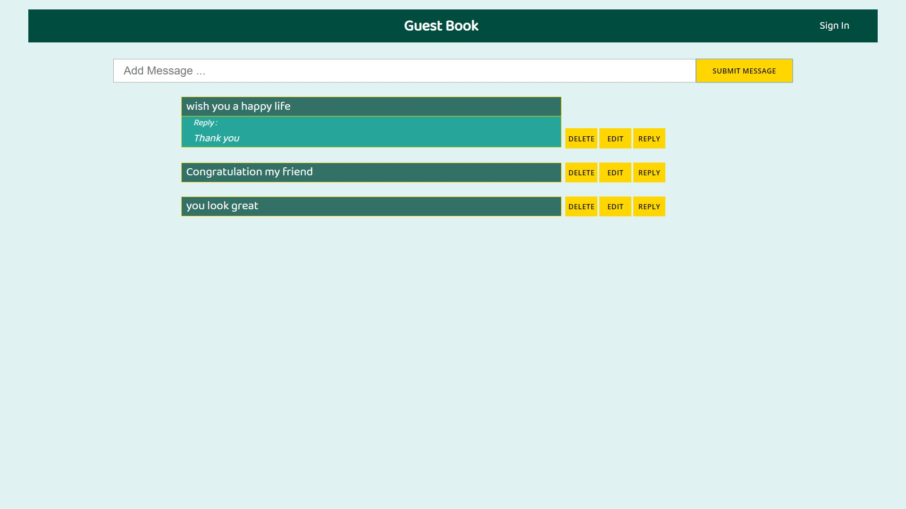

## Project Name

Guest Book

---
## Project Image

---

## Choices

### Decide on Components :
I seperated my components into two main folders components folder and pages folder, Inside the components folder I created some component that I may use many times inside my application separately like custom-button component and form-input component, And then divided each part that I am going to need in the application into a small components, And inside the pages component it contain the two pages that the application needed with their own sub components.

### Decide how to manage the state :
I saw that there is no need for using a state managment methods or libraries like Redux or ContextApi in this application for manage my state, And that is because the states I needed in this situation isn't used into many places in the app, So if I used Redux it would be adding more complixity and more lines of code that is not called for.

### Decide where the state lives :
I created the state that holds the visitors messages inside the messages component, that's because I used all the functionality of viewing, deleting, editing and replying to other messages all lies inside the messages component.

---
## Author Info
- Gmail - mahmoud.abdo59986@gmail.com
- LinkedIn - linkedin.com/in/mahmoud-abdo-a5b765102
- GitHub - github.com/Mahmoud-Abdo-599

